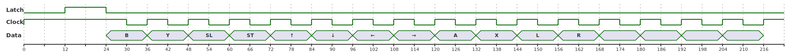

# SNES Controller

## Connector Pins

```
.-----------------.-----------.
|                 |            \
| (1) (2) (3) (4) | (5) (6) (7) |
|                 |            /
'-----------------'-----------'
```

| Pin  | Description  | Color |
| :--: | :----------- | :---: |
|  1   | +5 V         |  ⚪  |
|  2   | Data clock   |  🟡  |
|  3   | Data latch   |  🟠  |
|  4   | Serial data  |  🔴  |
|  5   | N/C          |  ◯  |
|  6   | N/C          |  ◯  |
|  7   | Ground       |  🟤  |

## Communication Protocol

Every 16.67 ms (60 Hz) the SNES sends a 12 µs wide high pulse on the latch pin (3). \
6 µs after the latch pulse, the SNES sends 16 clock pulses on the clock pin (2) each lasting 12 µs (6 µs low, 6 µs high). \
On every rising edge of the clock pulse (low -> high) the controller sends the state of the button on the data pin (4). (high = not pressed, 0 = pressed) \
Since the default state of the clock is high, the state of the first button is sends on the falling edge of the latch pulse. \
The clock cycle 13-16 are not used and the controller sends a high signal on the data pin. \
After all 16 clock cycles the controller sends a low signal on the data pin.

The controller sends the states in the following order:

| Clock Cycle | Button |
| :---------: | :----- |
|  1          | B      |
|  2          | Y      |
|  3          | Select |
|  4          | Start  |
|  5          | Up     |
|  6          | Down   |
|  7          | Left   |
|  8          | Right  |
|  9          | A      |
| 10          | X      |
| 11          | L      |
| 12          | R      |
| 13          |        |
| 14          |        |
| 15          |        |
| 16          |        |

### Timing Diagram



* Time axis in µs

<details>
  <summary>Sources</summary>

  * [FPGA Lover](https://www.fpgalover.com/index.php/boards/17-de0-nano-soc/43-snes-controller-module-de0-nano-soc)
  * [Gamespot](https://gamefaqs.gamespot.com/snes/916396-super-nintendo/faqs/5395)
</details>
